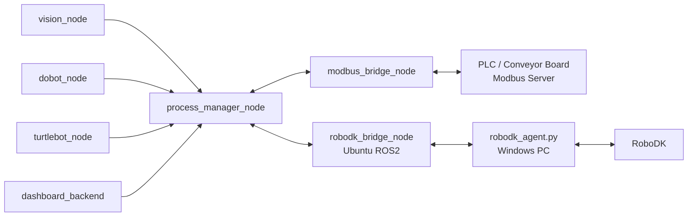
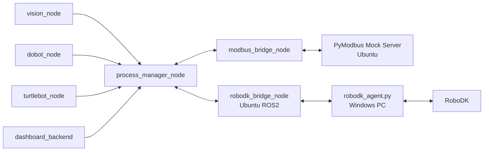
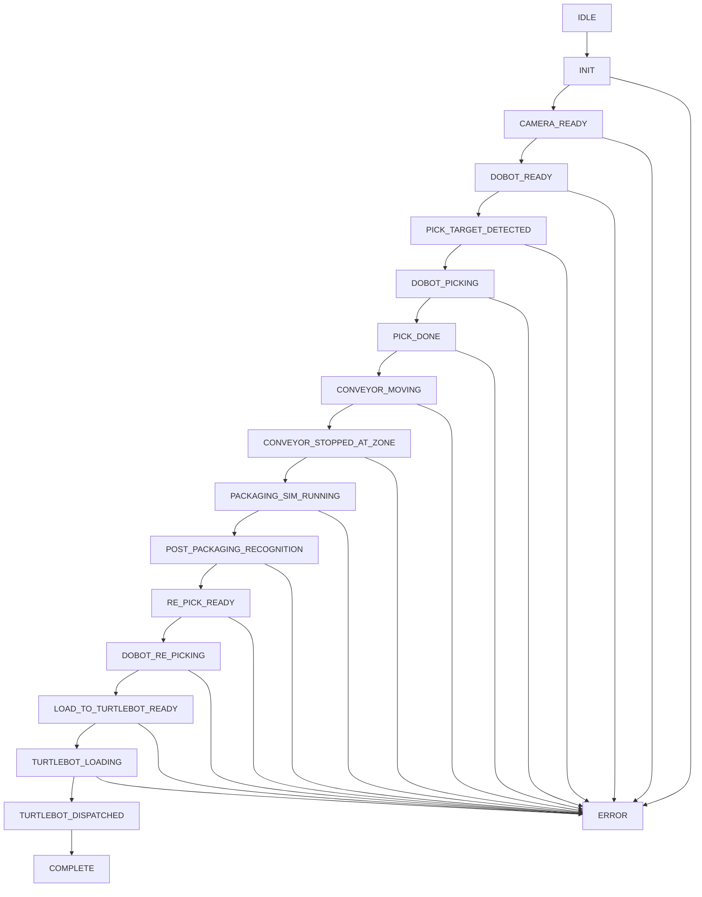
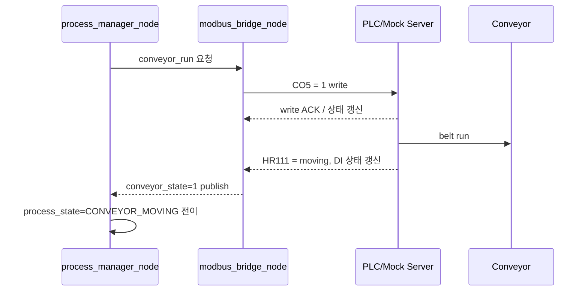
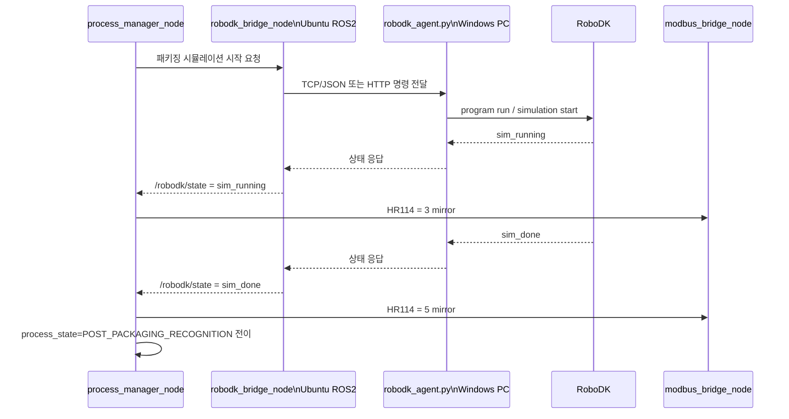

# Throughline_PJT Modbus 구조 초안

이 문서는 관통프로젝트에서 사용할 **Modbus 계층의 역할, 시스템 구조, 상태 흐름**을 정리한 초안이다.

현재 결론은 다음과 같다.

- Modbus는 **여러 로봇을 지능적으로 한 번에 제어하는 엔진**이 아니다.
- Modbus는 **정해진 주소의 coil/register 값을 읽고 쓰는 상태·명령 인터페이스**에 가깝다.
- 여러 장치가 같은 상태값을 보고 반응하도록 설계하면 결과적으로 동시에 움직이는 것처럼 보일 수 있지만, 실제 제어 판단은 상위 오케스트레이터가 담당한다.
- 따라서 관통프로젝트에서는 **ROS2 process_manager_node가 전체 시퀀스를 판단**하고, **modbus_bridge_node가 Modbus read/write만 담당**하는 구조를 기준안으로 둔다.

---

## 1. 목표

관통프로젝트에서 Modbus는 다음 목적에 사용한다.

1. 컨베이어/제어보드/PLC와의 **상태 교환**
2. 시작, 정지, 리셋 같은 **단순 명령 전달**
3. 공정 단계, 장치 ready/busy/fault 같은 **요약 상태 공유**
4. Dashboard, ROS2, 외부 장치가 공통으로 볼 수 있는 **얇은 상태판 역할**

Modbus에 직접 싣지 않을 대상:

- 카메라 픽셀 좌표
- point cloud
- 고주기 pose stream
- 긴 문자열 로그
- 복잡한 시퀀스 판단 로직

위 항목은 ROS2 topic/service/action, REST/WebSocket, SQLite에서 처리한다.

---

## 2. 핵심 해석

### 2-1. Modbus의 역할

관통프로젝트에서 Modbus는 다음으로 해석한다.

- **상태 전광판**
- **명령 버튼판**
- **장비 인터페이스 계층**

즉,

- `process_state=70` 같은 공정 단계 공유
- `cmd_start=1` 같은 제어 명령 pulse
- `conveyor_state=1` 같은 장비 상태 조회
- `error_code=3` 같은 오류 상태 공유

를 담당한다.

### 2-2. Modbus가 하지 않는 일

다음은 Modbus 자체의 책임이 아니다.

- 어떤 로봇이 다음 동작을 수행할지 판단
- 순서 제어
- timeout 복구 전략
- 다중 장치 간 충돌 해결
- 복잡한 동시성 조정

이 책임은 **process_manager_node**가 가진다.

---

## 3. 권장 구조

### 3-1. 최종 목표 구조

최종적으로는 **실제 컨베이어 보드 또는 PLC가 Modbus Server**이고, Ubuntu 쪽이 Client가 되는 구조를 우선 추천한다.



이 구조의 특징:

- 판단은 `process_manager_node`
- Modbus 송수신은 `modbus_bridge_node`
- 실제 장비 상태 저장소는 PLC/보드
- RoboDK는 Windows PC의 `robodk_agent.py`가 실제 API를 호출하고, Ubuntu의 `robodk_bridge_node`는 TCP/JSON 또는 HTTP로 명령/상태만 중계
- 각 장치 노드는 Modbus를 몰라도 됨

### 3-2. 개발 단계 구조

실제 PLC/보드가 아직 없거나 명세가 확정되지 않았을 때는 Ubuntu 안에 **PyModbus mock server**를 둔다.



이 구조의 목적:

- 실제 보드 없이 register map 먼저 검증
- Dashboard, 상태머신, 알람 처리 로직 선구현
- RoboDK는 ROS2 어댑터를 Windows에 설치하지 않고, Windows 에이전트와 Ubuntu bridge 사이의 네트워크 통신으로 분리
- 이후 mock server를 실제 PLC/보드로 교체 가능

### 3-3. RoboDK 연동 원칙

RoboDK는 Windows PC에서 실행하는 것을 기준으로 한다.

- Windows PC에는 ROS2 adapter를 붙이지 않는다.
- Windows PC에는 `robodk_agent.py`를 두고 RoboDK Python API 호출만 담당하게 한다.
- Ubuntu 쪽 `robodk_bridge_node`는 ROS2 service/topic과 Windows agent 사이의 통신 변환만 맡는다.
- RoboDK 실제 명령은 Modbus register에 억지로 싣지 않는다.
- Modbus에는 `HR114~HR117`에 RoboDK 요약 상태만 mirror한다.

권장 경로:

```text
process_manager_node
-> robodk_bridge_node
-> TCP/JSON 또는 HTTP
-> Windows robodk_agent.py
-> RoboDK Python API
```

---

## 4. 비권장 구조

다음 구조는 초기 실험은 가능하지만 기준 구조로 잡지 않는다.

### 4-1. launch 파일에 Modbus 로직 삽입

비권장 이유:

- launch는 프로세스 실행 orchestration 용도임
- 통신 로직과 상태 제어를 넣으면 디버깅이 어려워짐
- 재시작/복구/테스트 분리가 무너짐

### 4-2. 모든 장치 코드가 직접 Modbus client를 가지는 구조

예시:

- Dobot 코드가 직접 register write
- RoboDK 코드가 직접 register write
- Conveyor 코드가 직접 register write
- Dashboard도 직접 register write

문제점:

- 상태 소유권 불명확
- race condition 가능
- 누가 마지막 값을 썼는지 추적 어려움
- 실제 PLC 연동 전환 시 구조 변경 비용 증가

따라서 **Modbus 접근은 가급적 `modbus_bridge_node` 한 곳에 집중**한다.

---

## 5. 구성 요소 정의

| 컴포넌트 | 역할 | Modbus 직접 접근 여부 |
|---|---|---|
| process_manager_node | 전체 공정 상태머신, 단계 전이, timeout, 복구 판단 | 아니오 |
| modbus_bridge_node | register polling, coil/register write, ROS2-장비 상태 변환 | 예 |
| vision_node | 타겟 검출, 카메라 상태 publish | 아니오 |
| dobot_node | Dobot 제어 및 상태 publish | 아니오 |
| robodk_bridge_node | Ubuntu ROS2 쪽 RoboDK 중계 노드. process_manager 요청을 Windows agent로 전달하고 상태를 publish | 아니오 |
| robodk_agent.py | Windows PC에서 RoboDK API를 호출하는 경량 에이전트 | 아니오 |
| turtlebot_node | TurtleBot 준비/이송 상태 publish | 아니오 |
| dashboard_backend | REST/WebSocket/SQLite 및 수동 명령 입력 | 아니오 |
| PLC / Conveyor Board | 실제 센서, belt 제어, low-level 장비 상태 소유 | 예 |
| PyModbus Mock Server | 개발 단계의 가짜 PLC/가짜 상태 저장소 | 예 |

---

## 6. 상태 구조

### 6-1. 메인 공정 상태

`HR100 = process_state`

| 값 | 의미 |
|---|---|
| 0 | IDLE |
| 10 | INIT |
| 20 | CAMERA_READY |
| 30 | DOBOT_READY |
| 40 | PICK_TARGET_DETECTED |
| 50 | DOBOT_PICKING |
| 60 | PICK_DONE |
| 70 | CONVEYOR_MOVING |
| 80 | CONVEYOR_STOPPED_AT_ZONE |
| 90 | PACKAGING_SIM_RUNNING |
| 100 | POST_PACKAGING_RECOGNITION |
| 110 | RE_PICK_READY |
| 120 | DOBOT_RE_PICKING |
| 130 | LOAD_TO_TURTLEBOT_READY |
| 140 | TURTLEBOT_LOADING |
| 150 | TURTLEBOT_DISPATCHED |
| 900 | COMPLETE |
| 999 | ERROR |

### 6-2. 장치 상태 레지스터

| 주소 | 이름 | 의미 |
|---|---|---|
| HR110 | dobot_state | Dobot 상태 |
| HR111 | conveyor_state | Conveyor 상태 |
| HR112 | camera_state | Camera 상태 |
| HR113 | turtlebot_state | TurtleBot 상태 |
| HR114 | robodk_state | RoboDK 연결/시뮬레이션 요약 상태 |
| HR115 | robodk_last_cmd | 마지막 RoboDK 명령 코드 |
| HR116 | robodk_last_ack_seq | 마지막 RoboDK 명령 응답 sequence |
| HR117 | robodk_error_code | RoboDK 에이전트/시뮬레이션 오류 코드 |

### 6-3. RoboDK 상태 정의

`HR114 = robodk_state`

| 값 | 의미 |
|---|---|
| 0 | offline |
| 1 | ready |
| 2 | station_loaded |
| 3 | sim_running |
| 4 | sim_paused |
| 5 | sim_done |
| 6 | waiting_trigger |
| 9 | fault |

### 6-4. 장치 상태 예시

#### Dobot
| 값 | 의미 |
|---|---|
| 0 | offline |
| 1 | ready |
| 2 | busy |
| 3 | paused |
| 9 | fault |

#### Conveyor
| 값 | 의미 |
|---|---|
| 0 | stopped |
| 1 | moving |
| 2 | jam |
| 3 | sensor_wait |
| 9 | fault |

#### Camera
| 값 | 의미 |
|---|---|
| 0 | offline |
| 1 | ready |
| 2 | detecting |
| 3 | calibration_needed |
| 9 | fault |

#### TurtleBot
| 값 | 의미 |
|---|---|
| 0 | offline |
| 1 | standby |
| 2 | docking |
| 3 | loaded |
| 4 | moving |
| 9 | fault |

---

## 7. 제안 register map v0.1

### 7-1. Coil: 순간 명령

| 주소 | 이름 | 의미 |
|---|---|---|
| CO0 | cmd_start | 공정 시작 |
| CO1 | cmd_stop | 공정 정지 |
| CO2 | cmd_pause | 일시정지 |
| CO3 | cmd_reset | fault reset |
| CO4 | cmd_ack_alarm | 알람 확인 |
| CO5 | cmd_conveyor_run | 컨베이어 구동 |
| CO6 | cmd_conveyor_stop | 컨베이어 정지 |
| CO7 | cmd_manual_mode | 수동모드 전환 |

권장 방식:

- coil은 **pulse 성격**으로 사용
- client가 1을 쓰고, 서버 또는 상위 로직이 처리 후 0으로 복귀
- 장시간 1 유지 상태를 명령 의미로 쓰지 않음

### 7-2. Discrete Input: 읽기 전용 비트 센서

| 주소 | 이름 | 의미 |
|---|---|---|
| DI0 | sensor_infeed | 투입 감지 |
| DI1 | sensor_pick_zone | 픽업 위치 감지 |
| DI2 | sensor_packaging_zone | 패키징 위치 감지 |
| DI3 | sensor_outfeed | 배출 감지 |
| DI4 | estop_input | 비상정지 |
| DI5 | door_open | 안전문 열림 |

### 7-3. Holding Register: 공정/장치 상태

| 주소 | 이름 | 의미 |
|---|---|---|
| HR100 | process_state | 전체 공정 상태 enum |
| HR101 | process_substate | 세부 단계 |
| HR102 | command_seq | 명령 시퀀스 번호 |
| HR103 | last_ack_seq | 마지막 ack된 시퀀스 |
| HR104 | error_code | 오류 코드 |
| HR105 | warn_code | 경고 코드 |
| HR106 | heartbeat_pc | PC/bridge heartbeat |
| HR107 | heartbeat_plc | PLC/server heartbeat |
| HR110 | dobot_state | Dobot 상태 |
| HR111 | conveyor_state | Conveyor 상태 |
| HR112 | camera_state | Camera 상태 |
| HR113 | turtlebot_state | TurtleBot 상태 |
| HR114 | robodk_state | RoboDK 연결/시뮬레이션 요약 상태 |
| HR115 | robodk_last_cmd | 마지막 RoboDK 명령 코드 |
| HR116 | robodk_last_ack_seq | 마지막 RoboDK 명령 응답 sequence |
| HR117 | robodk_error_code | RoboDK 에이전트/시뮬레이션 오류 코드 |
| HR120 | target_count_total | 총 대상 수 |
| HR121 | target_count_done | 완료 수 |
| HR122 | target_count_ng | 실패 수 |
| HR130 | conveyor_speed_set | 속도 설정 |
| HR131 | conveyor_speed_actual | 실제 속도 |
| HR140 | manual_command_code | 수동 명령 코드 |
| HR141 | manual_command_arg0 | 수동 명령 인자 |
| HR142 | manual_command_arg1 | 수동 명령 인자 |
| HR150 | operation_mode | 0=manual, 1=auto, 2=maintenance |

### 7-4. Input Register: 읽기 전용 측정값

| 주소 | 이름 | 의미 |
|---|---|---|
| IR200 | sensor_distance_mm | 거리값 |
| IR201 | cycle_time_ms | 최근 사이클 시간 |
| IR202 | alarm_active_code | 현재 활성 알람 |
| IR203 | board_temperature | 보드 온도 등 |

---

## 8. 시스템 흐름도

### 8-1. 상위 상태 흐름



### 8-2. 컨베이어 시작 흐름



### 8-3. RoboDK 패키징 시뮬레이션 흐름



---

## 9. 소유권 원칙

### 9-1. 상태 판단의 소유자

- **process_manager_node**가 전체 공정 상태를 결정한다.
- 장치 노드는 자기 상태만 publish 한다.
- `modbus_bridge_node`는 장치/서버 간 번역과 입출력만 담당한다.

### 9-2. register write의 기본 원칙

- 공정 상태 `HR100` 계열은 상위 오케스트레이터에서 관리
- 실제 센서/보드 상태는 PLC 또는 mock server가 소유
- 장치 요약 상태 `HR110~114`는 process_manager 또는 bridge에서 mirror
- 여러 노드가 같은 레지스터를 직접 동시에 write 하지 않음

---

## 10. 왜 이런 구조를 쓰는가

### 장점

1. **역할 분리**
   - 판단과 I/O가 분리됨
2. **실장비 치환 용이**
   - mock server를 실제 PLC로 바꾸기 쉬움
3. **디버깅 단순화**
   - Modbus 문제를 bridge/board 계층에서 좁혀 볼 수 있음
4. **Dashboard 연동 용이**
   - 상태 정의가 register map과 일치함
5. **RoboDK/Dobot/비전 계층 독립성 유지**
   - 각 노드가 Modbus에 직접 종속되지 않음

### 피해야 할 구조

- launch 파일 안에서 Modbus polling 수행
- 각 장치 코드가 공통 register를 직접 수정
- 비전 raw 데이터까지 Modbus에 적재
- 장치별 상태와 공정 상태의 소유권이 섞인 구조

---

## 11. 개발 순서 제안

1. `process_state`, 장치 상태 enum 확정
2. register map v0.1 확정
3. Ubuntu mock server 작성
4. `modbus_bridge_node` 작성
5. ROS2 메시지/서비스 인터페이스 정의 확정
6. `process_manager_node`와 연결
7. `robodk_bridge_node`와 Windows `robodk_agent.py` 통신 규격 확정
8. Dashboard에서 상태 표시
9. 실제 PLC/컨베이어 보드 명세 반영
10. mock server를 실제 장비로 교체

ROS2 인터페이스 초안은 [`ROS2_INTERFACES_DRAFT.md`](./ROS2_INTERFACES_DRAFT.md)에 따로 둔다. 실제 작업 컴퓨터에 복사할 수 있는 `.msg`/`.srv` 초안은 [`ros2_interfaces_draft/throughline_interfaces`](./ros2_interfaces_draft/throughline_interfaces)에 둔다. `modbus_bridge_node`의 topic/service/parameter 골격은 [`ros2_nodes_draft/throughline_modbus_bridge`](./ros2_nodes_draft/throughline_modbus_bridge)에 interface-only stub으로 둔다.

---

## 12. 현재 문서의 상태

이 문서는 **구현 전 구조 초안**이다.

아직 확정되지 않은 항목:

- 실제 컨베이어 보드가 Modbus TCP인지 RTU인지
- 실제 register 주소 제약
- slave/unit id 규칙
- speed/센서/alarm의 실제 보드 매핑
- RoboDK 쪽 실제 trigger 방식
- `robodk_bridge_node`와 Windows `robodk_agent.py` 사이의 전송 방식(TCP/JSON 또는 HTTP)

따라서 이 문서는 **상위 구조 기준안**으로 사용하고, 실제 장비 명세가 확인되면 register map 세부주소와 시퀀스를 보정한다.
