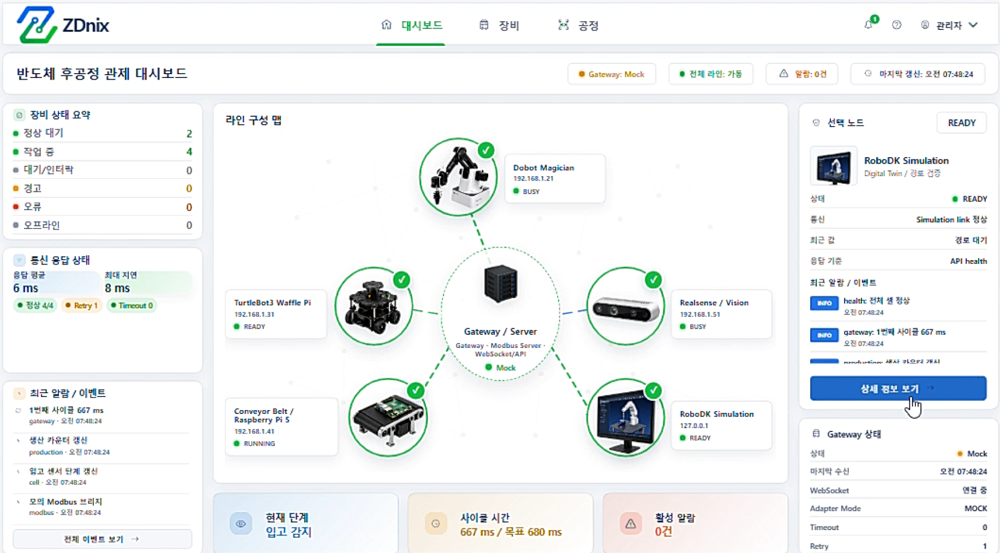
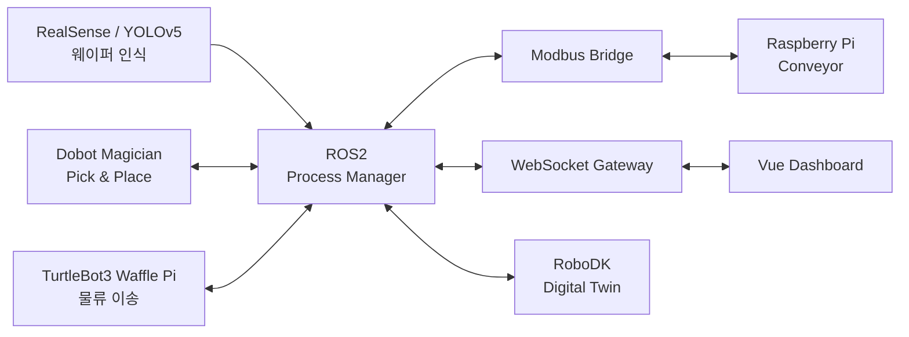
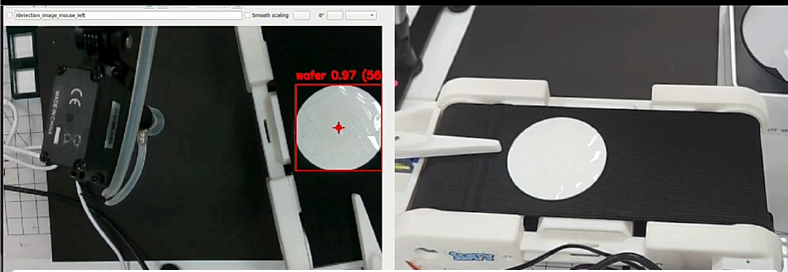
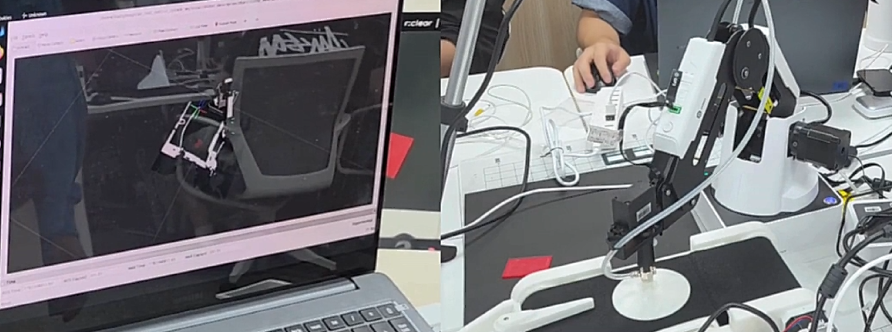
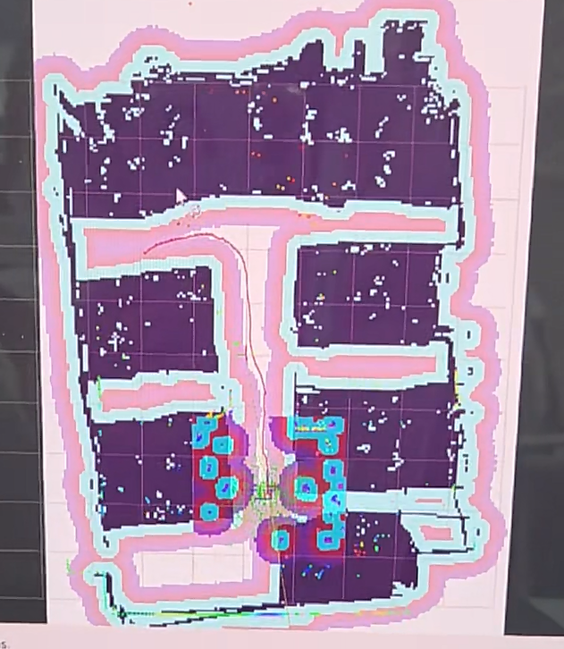
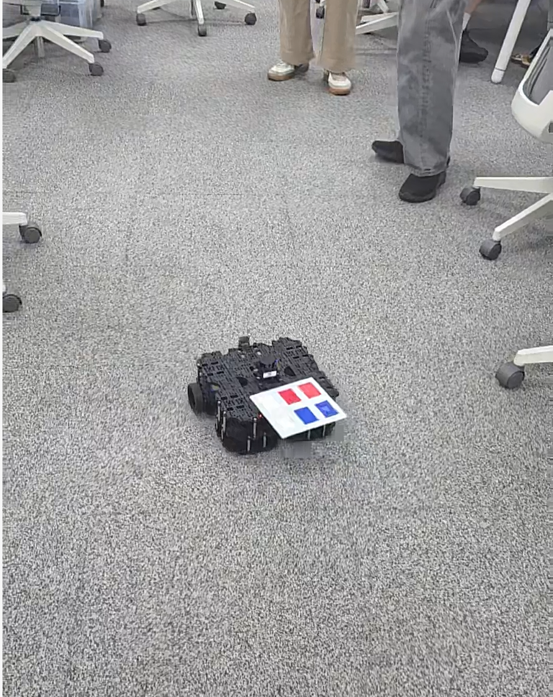
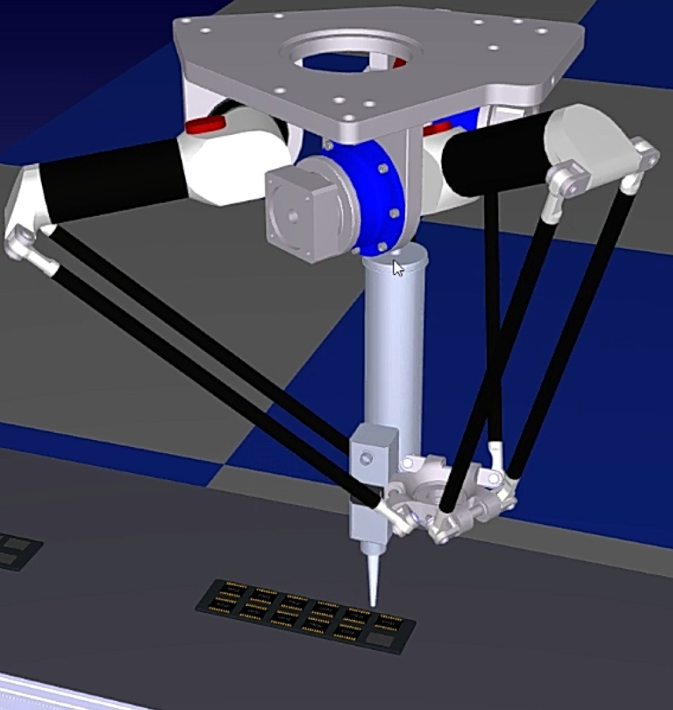
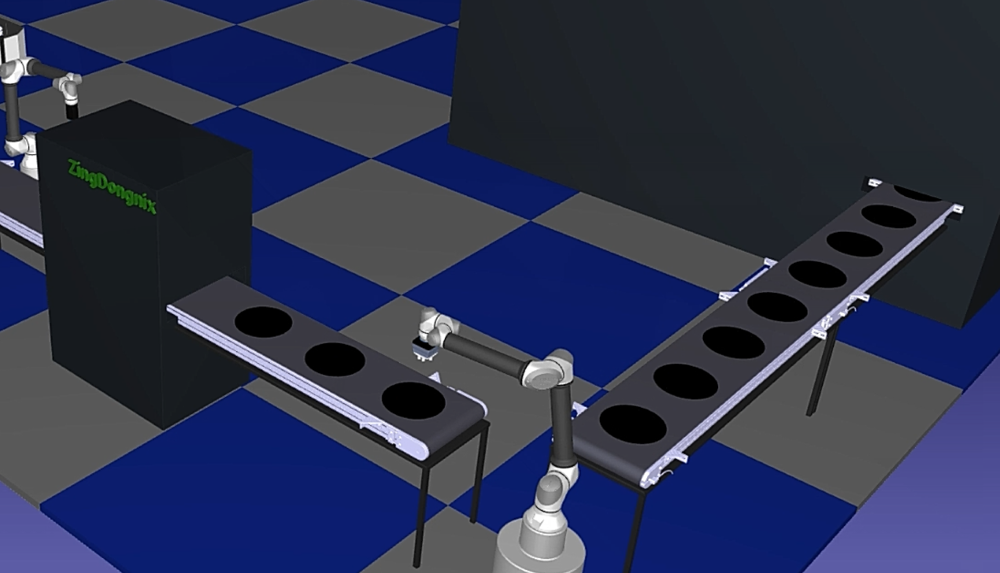

# 반도체 후공정 디지털 트윈 통합 관제 시스템

Dobot Magician, TurtleBot3 Waffle Pi, Raspberry Pi 기반 컨베이어, Intel RealSense와 RoboDK를 연동하여  
**반도체 후공정의 웨이퍼 이송·비전 인식·로봇 작업·공정 시뮬레이션·상태 관제**를 구현한 프로젝트입니다.

<p align="center">
  
</p>

---

## 프로젝트 개요

실제 장비에서 발생하는 공정 동작과 RoboDK 디지털 트윈의 시뮬레이션을 함께 구성하고,  
장비 상태와 공정 진행 상황을 웹 대시보드에서 확인할 수 있도록 구현했습니다.

- RealSense 카메라와 YOLOv5를 활용한 웨이퍼 인식
- Dobot Magician 기반 웨이퍼 Pick & Place
- Raspberry Pi 기반 컨베이어 제어 및 상태 전달
- TurtleBot3 Waffle Pi 기반 SLAM·자율주행 및 공정 간 물류 이송
- RoboDK 기반 반도체 후공정 디지털 트윈 구현
- ROS2, Modbus, WebSocket을 활용한 장비 및 관제 시스템 연동
- 웹 대시보드를 통한 장비 상태, 공정 단계, 응답시간 및 이벤트 확인

---

## 시스템 구성



### 공정 흐름

1. 카메라 영상에서 웨이퍼를 인식합니다.
2. Dobot Magician이 웨이퍼를 Pick & Place 합니다.
3. 컨베이어가 웨이퍼와 가공물을 다음 공정으로 이송합니다.
4. 공정 상태와 장비 상태를 ROS2 및 Modbus로 전달합니다.
5. RoboDK에서 웨이퍼, DIE, 트레이 적재 및 로봇 공정을 시뮬레이션합니다.
6. WebSocket을 통해 웹 대시보드에 상태와 이벤트를 표시합니다.

---

## 주요 기능

### 1. 통합 관제 대시보드

장비별 상태, 현재 공정 단계, 통신 상태, 응답시간, 알람과 최근 이벤트를 한 화면에서 확인할 수 있도록 구성했습니다.

<p align="center">
  
</p>

### 2. 웨이퍼 비전 인식

Intel RealSense 영상에서 YOLOv5 모델을 이용해 웨이퍼를 탐지하고, 인식 결과를 로봇 작업에 활용했습니다.

<p align="center">
  
</p>

### 3. Dobot Pick & Place 및 디지털 트윈

실제 Dobot Magician의 웨이퍼 이송 동작을 구현하고, 동일한 작업 환경을 디지털 공간에서 확인할 수 있도록 구성했습니다.

<p align="center">
  
</p>

### 4. Waffle Pi 자율주행 물류 이송

TurtleBot3 Waffle Pi를 활용해 공정 장비 사이를 이동하는 물류 이송 동작을 구현했습니다.  
SLAM으로 주행 환경의 맵을 생성하고, 생성한 맵을 기반으로 로봇의 위치를 추정하며 목표 지점까지 자율주행하도록 구성했습니다.

<p align="center">
  
  
</p>

- SLAM 기반 실내 지도 생성
- 로봇 위치 추정 및 목표 지점 주행
- 공정 장비 간 물류 이송 시나리오 구현
- 실제 주행 테스트를 통한 경로 및 위치 보정

### 5. RoboDK 후공정 시뮬레이션

RoboDK에서 로봇, 컨베이어, 웨이퍼, DIE, 트레이 및 공정 장비를 배치하고 Python API로 작업 순서를 제어했습니다.

<p align="center">
  
  
</p>

- 웨이퍼 자동 생성 및 컨베이어 이송
- 웨이퍼를 DIE 객체로 변환하는 공정 표현
- 로봇을 이용한 DIE 트레이 적재
- 공정 완료 트레이의 다음 컨베이어 이동
- Delta Robot 기반 후속 공정 시뮬레이션
- 로봇 접근 위치, 작업 위치 및 대기 위치 제어

---

## 담당 역할

### Team Leader / RoboDK Digital Twin / Waffle Pi

- 팀장으로서 프로젝트 일정 및 역할 분담 관리
- RoboDK 기반 반도체 후공정 디지털 트윈 설계 및 구현
- 로봇, 컨베이어, 공정 설비 및 오브젝트 배치
- 웨이퍼 이송, DIE 생성, 트레이 적재 및 후속 공정 시나리오 구현
- 로봇별 작업 좌표, 접근 위치, 대기 자세 및 Pick & Place 동작 설정
- TurtleBot3 Waffle Pi 기반 자율주행 물류 이송 담당
- SLAM을 활용한 주행 환경 맵 생성 및 위치 추정
- 공정 장비 사이를 이동하는 자율주행 경로와 물류 이송 동작 구현
- 실제 주행 결과와 공정 흐름을 반복 검증하고 이동 경로를 조정

---

## 기술 스택

### Languages

<p>
  
  
  
  
  
</p>

### Robotics / Digital Twin

<p>
  
  
  
  
  
</p>

### Embedded / Hardware

<p>
  
  
  
  
</p>

### AI / Computer Vision

<p>
  
  
  
</p>

### Communication / Web

<p>
  
  
  
  
  
  
  
</p>

---

## 프로젝트 구조

```text
semiconductor-digital-twin
├─ Modbus/
├─ RoboDK/
│  ├─ assets/
│  │  ├─ AGV/
│  │  ├─ Convey/
│  │  ├─ Object/
│  │  ├─ Robot/
│  │  └─ Tool/
│  ├─ scripts/
│  │  ├─ ImportCode.py
│  │  └─ Wafer_move.py
│  └─ stations/
│     └─ Penetrate_PJT.rdk
├─ WebSocket/
├─ main_ws/
├─ web/dashboard/
├─ websocket/
├─ yolo_v5/
├─ datasets/
├─ record_data/
├─ images/
└─ README.md
```

---

## 실행 방법

### 1. 저장소 복제

```bash
git clone https://github.com/rootjihn/semiconductor-digital-twin.git
cd semiconductor-digital-twin
```

### 2. RoboDK 시뮬레이션

#### 필요 환경

- Windows
- RoboDK
- Python 3
- RoboDK Python API

```bash
pip install robodk
```

1. RoboDK에서 `RoboDK/stations/Penetrate_PJT.rdk` 파일을 엽니다.
2. 스테이션 구성과 오브젝트를 초기화합니다.

```bash
python RoboDK/scripts/ImportCode.py
```

3. 웨이퍼 이송 및 후공정 시뮬레이션을 실행합니다.

```bash
python RoboDK/scripts/Wafer_move.py
```

> `Wafer_move.py`는 연속 공정을 표현하기 위해 반복 실행됩니다. 종료할 때는 실행 터미널에서 `Ctrl + C`를 입력합니다.

### 3. Vue 관제 대시보드

```bash
cd WebSocket
npm install
```

Gateway 실행:

```bash
npm run gateway
```

다른 터미널에서 대시보드 실행:

```bash
npm run dev
```

브라우저에서 다음 주소로 접속합니다.

```text
http://localhost:5173
```

### 4. 정적 대시보드 MVP

```bash
cd web/dashboard
python -m http.server 5173
```

브라우저에서 `http://localhost:5173`으로 접속합니다.

> ROS2, Modbus 및 Python WebSocket 모듈의 세부 실행 방법은 각 폴더 내부의 README 문서를 참고합니다.

---

## 배운 점

- 실제 장비와 시뮬레이션을 하나의 공정 흐름으로 설계하는 경험
- 로봇 좌표계, Tool Frame, Base Frame 및 객체 Parent 관계에 대한 이해
- 여러 로봇과 컨베이어의 동작 순서를 Python으로 제어하는 방법
- 비전 인식 결과를 로봇 작업과 연결하는 과정
- ROS2, Modbus 및 WebSocket의 역할을 구분해 시스템을 구성하는 방법
- 장비 상태와 공정 이벤트를 웹 화면에서 확인하는 관제 구조 설계

---

## 개선 방향

- 실제 장비 상태와 RoboDK 시뮬레이션 상태의 실시간 동기화 강화
- 공정 오류 발생 시 복구 시나리오 및 알람 처리 추가
- 공정별 Cycle Time 저장 및 생산성 분석 기능 구현
- 장비 연결 정보와 경로 설정을 별도 환경설정 파일로 분리
- 단위 테스트와 공정 시나리오 테스트 자동화

---

## Repository

- Project Repository: https://github.com/rootjihn/semiconductor-digital-twin
- GitHub Profile: https://github.com/rootjihn
- Original Team Repository: https://github.com/Throughline-PJT/develop
