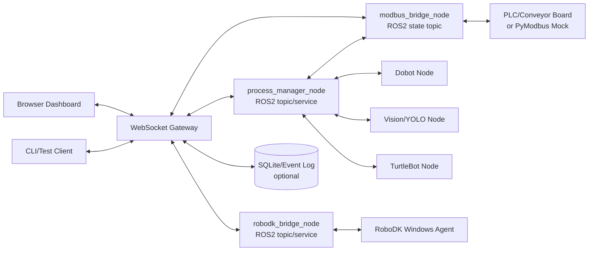

# Throughline WebSocket 서버/클라이언트 구현 계획

이 문서는 `/home/ssafy/penetrate_pjt/websocket/`에서 진행할 WebSocket 계층의 기준 구조, 다른 시스템과의 연동 원칙, 순차 MVP를 정의한다.

## 1. 역할 정의

WebSocket 계층은 Dashboard/외부 클라이언트와 ROS2 기반 공정 시스템 사이의 **실시간 상태/명령 게이트웨이**다.

- 담당한다
  - Dashboard에 공정 상태, 장치 상태, 알람, 이벤트를 실시간 push
  - Dashboard의 수동 명령을 `process_manager_node`로 전달할 수 있는 표준 JSON envelope 제공
  - 브라우저/CLI 클라이언트가 같은 프로토콜로 연결되는 최소 구현 제공
  - ROS2 topic/service 연동 전까지 mock/simulated publish로 UI와 프로토콜 선검증
- 담당하지 않는다
  - Modbus register를 직접 polling/write하는 책임
  - Dobot/RoboDK/TurtleBot의 실제 동작 판단
  - 카메라 이미지/point cloud 같은 고주기 대용량 스트림 전송
  - 공정 상태머신의 최종 판단

기준 원칙: WebSocket 서버는 **Modbus에 직접 붙지 않고**, ROS2의 `process_manager_node`, `modbus_bridge_node`, 각 장치 bridge가 publish하는 요약 상태를 받아 Dashboard로 중계한다.

## 2. 전체 연동 구조



## 3. 메시지 envelope v0.1

모든 WebSocket text frame은 JSON object를 사용한다.

### 3-1. 공통 필드

```json
{
  "type": "hello | echo | publish | state | command | command_ack | error | ping | pong",
  "source": "dashboard | cli | process_manager | modbus_bridge | robodk_bridge | simulator",
  "topic": "/cell/process/state",
  "payload": {},
  "request_id": "optional-client-request-id"
}
```

### 3-2. 상태 publish

```json
{
  "type": "publish",
  "source": "simulator",
  "topic": "/cell/modbus/state",
  "payload": {
    "process_state": 70,
    "conveyor_state": 1,
    "error_code": 0
  }
}
```

서버는 topic별 최신 상태를 저장하고 전체 클라이언트에 다음 형식으로 broadcast한다.

```json
{
  "type": "state",
  "snapshot": {
    "topics": {
      "/cell/modbus/state": {
        "source": "simulator",
        "payload": {"process_state": 70},
        "updated_at": "2026-01-01T00:00:00Z"
      }
    },
    "commands": [],
    "events": []
  }
}
```

### 3-3. 명령 요청

Dashboard 명령은 WebSocket 서버에서 장비로 직접 쓰지 않는다. 서버는 명령을 검증·기록하고, 이후 ROS2 service adapter가 `process_manager_node` 또는 안전한 command service로 넘긴다.

```json
{
  "type": "command",
  "source": "dashboard",
  "target": "process_manager",
  "command": "start",
  "args": {},
  "request_id": "cmd-001"
}
```

허용 명령 v0.1:

| command | 대상 | 의미 |
|---|---|---|
| `start` | process_manager | 공정 시작 요청 |
| `stop` | process_manager | 정지 요청 |
| `pause` | process_manager | 일시정지 요청 |
| `reset` | process_manager | 에러/상태 리셋 요청 |
| `ack_alarm` | process_manager | 알람 확인 |
| `conveyor_run` | process_manager | 컨베이어 구동 요청 |
| `conveyor_stop` | process_manager | 컨베이어 정지 요청 |
| `manual_mode` | process_manager | 수동 모드 전환 요청 |

## 4. 순차 MVP

### MVP 01 — WebSocket echo/health

목표:
- 외부 의존성 없이 Python 표준 라이브러리만으로 WebSocket handshake/text frame 송수신 확인
- `/health` HTTP endpoint 제공
- CLI client로 echo 왕복 검증

산출물:
- `src/throughline_ws/ws_protocol.py`
- `src/throughline_ws/server.py`
- `src/throughline_ws/client.py`
- `tests/test_protocol.py`, `tests/test_server_smoke.py`

검증:

```bash
cd /home/ssafy/penetrate_pjt/websocket
PYTHONPATH=src python3 -m unittest discover -s tests -v
```

### MVP 02 — 상태 hub/broadcast

목표:
- `publish` 메시지를 topic별 최신 snapshot으로 저장
- 연결된 모든 client에 `state` 메시지 broadcast
- process/modbus/robodk 요약 상태를 동일한 envelope로 수신 가능하게 함

검증 예시:

```bash
PYTHONPATH=src python3 -m throughline_ws.server --host 0.0.0.0 --port 8765
PYTHONPATH=src python3 -m throughline_ws.client publish --url ws://127.0.0.1:8765/ws --topic /cell/modbus/state --payload '{"process_state":70,"conveyor_state":1}'
```

### MVP 03 — ROS2 연동 adapter 경계

목표:
- 실제 `rclpy`가 없는 개발 환경에서도 import 가능한 adapter skeleton 제공
- 향후 ROS2 환경에서 다음 topic/service에 붙일 위치를 명확히 함
  - subscribe: `/cell/modbus/state`
  - subscribe: `/cell/process/state`
  - subscribe: `/cell/robodk/state`
  - service client: `/cell/process/command`

산출물:
- `src/throughline_ws/integration_adapters.py`

정책:
- Modbus 직접 polling 금지
- WebSocket 명령은 process_manager service를 통해서만 장비 동작으로 전환

### MVP 04 — 브라우저 Dashboard client

목표:
- 별도 프론트 빌드 없이 `clients/browser_client.html`만 열어 연결/상태/명령 테스트
- 팀원이 로컬 브라우저에서 `ws://서버IP:8765/ws`를 입력해 확인 가능

산출물:
- `clients/browser_client.html`

### MVP 05 — 지속화/운영화

목표:
- 이벤트/명령 ack를 SQLite에 저장
- systemd 또는 Docker Compose로 서버 상시 실행
- 인증 토큰 또는 내부망 접근 제한 추가

현재 구현:
- `--sqlite-path` 옵션을 주면 `publish`/`command` 이벤트를 SQLite `gateway_events` 테이블에 저장한다.
- 실행 스크립트: `scripts/run_mvp05_server_with_log.sh`

아직 구현하지 않을 것:
- 인증 없는 외부망 공개
- 이미지/영상 stream 전송
- PLC/Modbus 직접 write

## 5. 구현 순서

1. MVP 01 코드 작성 후 unit/smoke test 통과
2. MVP 02 상태 hub 추가 후 publish/broadcast test 통과
3. MVP 03 adapter skeleton 추가 후 ROS2 없는 환경에서 import 가능성 확인
4. MVP 04 browser client 작성 후 수동 연결 경로 제공
5. 실제 ROS2 PC에서 `rclpy` dependency를 확인한 뒤 adapter 구현을 별도 단계로 확장

## 6. 운영 명령

서버 실행:

```bash
cd /home/ssafy/penetrate_pjt/websocket
PYTHONPATH=src python3 -m throughline_ws.server --host 0.0.0.0 --port 8765
```

상태 publish:

```bash
PYTHONPATH=src python3 -m throughline_ws.client publish \
  --url ws://127.0.0.1:8765/ws \
  --topic /cell/process/state \
  --payload '{"process_state":10,"message":"init"}'
```

명령 요청:

```bash
PYTHONPATH=src python3 -m throughline_ws.client command \
  --url ws://127.0.0.1:8765/ws \
  --command start \
  --target process_manager
```

브라우저:

```text
/home/ssafy/penetrate_pjt/websocket/clients/browser_client.html
```

## 7. 다음 확장 체크리스트

- ROS2 interface 이름이 확정되면 `integration_adapters.py`에서 topic/service 이름을 상수로 고정
- process_manager가 명령 ack 정책을 정하면 `command_ack` payload에 `accepted`, `error_code`, `last_ack_seq` 반영
- Dashboard UI가 확정되면 상태 topic별 렌더링 컴포넌트 분리
- 외부 접속이 필요하면 인증/방화벽/프록시를 먼저 설계
